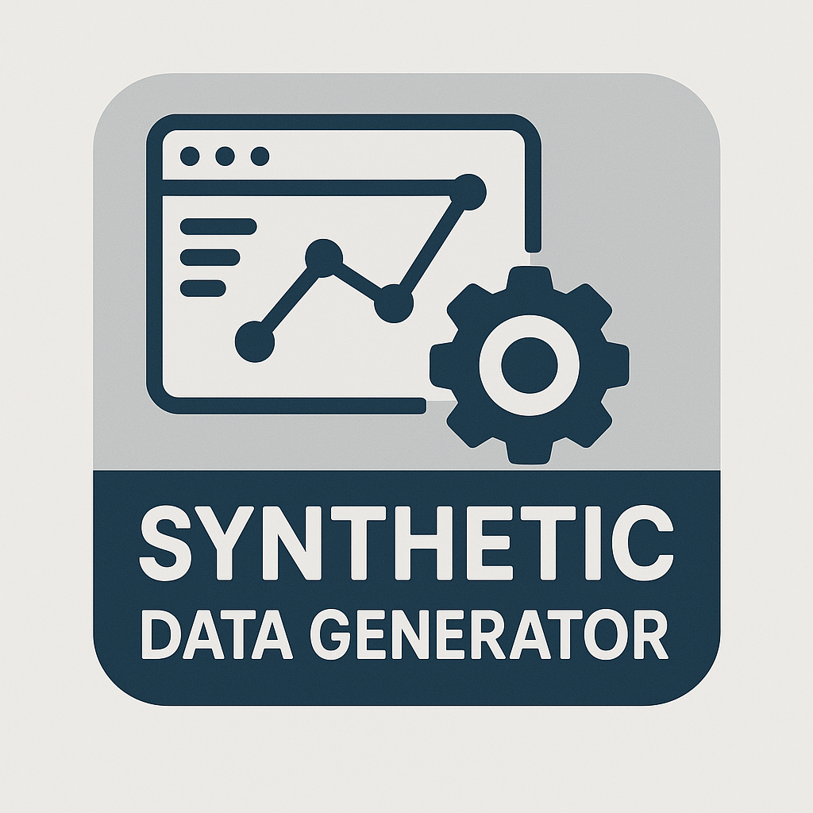

# ENGINEERING SYNTHETIC DATA GENERATOR 🌟

🤖 **What is it?**
The Synthetic Data Generator is a tool designed to generate artificial data that mimics the characteristics of real-world data. 📊 
This tool is useful for testing, training, and validating machine learning models, as well as for generating data for demonstration or proof-of-concept purposes. 📈

## KEY FEATURES 🎉

* 🚀 **Scalable and extensible architecture**: Generate synthetic data that grows with your needs!
* 👥 **Easy interaction**: UX and UI designed for humans, not just machines! 🤖
* 🚀 **One-click deploy**: Get started in no time with our simple deployment process! 🚀

## GETTING STARTED 🚀

🐳 **Deploy with Docker Compose**
```bash
docker-compose up -d
```

Once the containers are up and running, you can access the UI at http://localhost:5173 🌐


### CUSTOMIZING THE ENVIRONMENT 🎨

📝 Modify the Docker Compose file: Change environment variables to customize the environment to your needs! 🤔


## GETTING THE DOCUMENTATION 📚

The Synthetic Data Generator has three main components, aggregated as independent microservices:

- Frontend 
- Middleware 
- Generator. 

Each container exposes OpenAPI documentation on the ports specified in the Docker Compose file. 📊


## CONTRIBUTING 🤝

👋 We welcome contributions! Fork the repository and submit a pull request. 💻
 
