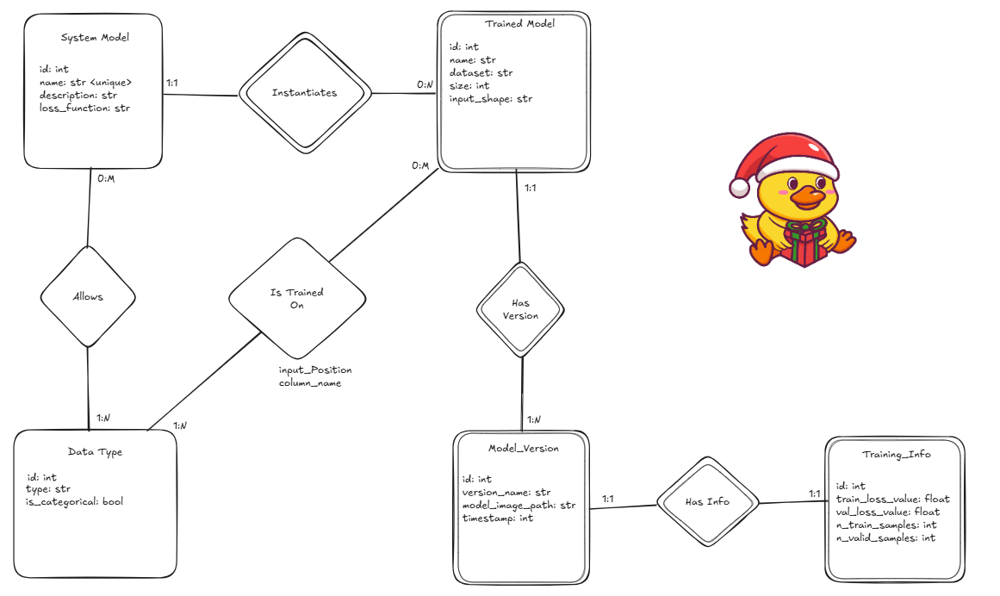

## Model Repository
This module implements a catalogue
who's job is to offer CRUD operations to other modules
that are interested in obtaining info
/ saving ML models. This package is composed mainly of two folders:
### 1. Database folder
The database folder contains all code that handles the definition and
population of the following database schema that we have defined:

*The db schema defined by us*  
In details, inside this folder there are two files:
*   `mock_data_generator.py` is responsible for the generation and
insertion of fake data inside the database
* `model.py` is the definition of our db schema with an ORM (in this
case is peewe). The ORM let's us easily create queries that are used by
the `service.py` module
### 2. Server folder
The server folder houses the implementation of the business logic as
well as the definition of the endpoints that the model registry offers.
This folder organization follows the Model - Controller - Service 
architectural style. Infact:
* `controller.py` is the module responsible for the definition
of the model repository endpoints
* `service.py` implements the business logic of the model repository and
uses the ORM defined in `model.py`.