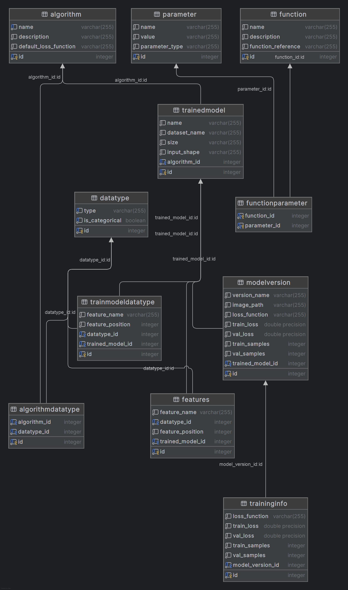

### Server Folder Documentation

#### `main.py`
This file serves as the main entry point for the FastAPI application. 
It sets up the FastAPI app with configuration details such as the title, description, and version. 
It also configures CORS middleware to handle cross-origin requests based on environment variables and includes various routers to handle different API endpoints.

#### `routers/trained_models.py`
Handles routes related to trained machine learning models. 
This may include endpoints for retrieving, updating, and deleting trained models. 
The exact methods and functionalities are determined by the implementation of the associated router.

#### `routers/functions.py`
Manages API routes related to functions. 
This file typically defines endpoints for handling CRUD operations on function-related data within the application.

#### `routers/algorithm.py`
Contains routes associated with algorithms. 
It likely facilitates operations such as listing available algorithms, fetching details about specific algorithms, and managing their associations with data types.

#### `routers/sdg_input/handlers.py`
Processes user-provided data files, analyzing their structure and content. 
It includes functionality for determining column types and formats within the datasets provided by users.

#### `dummy_data_generator.py`
Generates synthetic data for testing purposes. It includes functions to insert data into the database based on predefined schemas.

#### `database/schema.py`
Defines the schema for the database tables. 
It includes definitions for tables, columns, and relationships between tables.
For the sake of simplicity, the schema is reported here below

